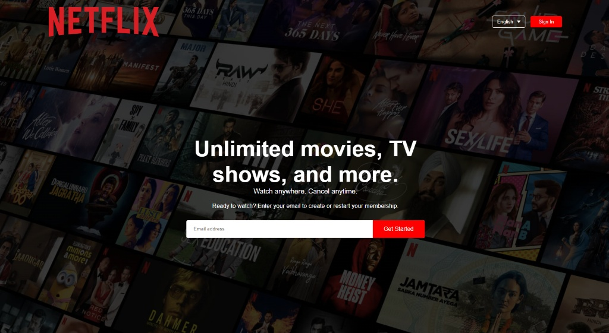

# 🎬 Netflix Homepage Clone

A responsive Netflix Homepage Clone built using HTML and CSS. This project recreates the Netflix landing page with a modern user interface, feature sections, FAQ accordion, and responsive design for different screen sizes.

## 🚀 Live Demo

👉 https://harikrishnanvk18.github.io/netflix-homepage-clone/

## 📸 Preview



## ✨ Features

- Netflix-inspired homepage design
- Fully responsive layout
- Hero section with background overlay
- Feature showcase sections
- FAQ accordion using pure HTML & CSS
- Footer with navigation links
- Clean and modern UI

## 🛠️ Technologies Used

- HTML5
- CSS3
- Flexbox
- Media Queries

## 📂 Project Structure

```text
netflix-homepage-clone/
│
├── index.html
├── style.css
├── screenshot.png
└── images/
    ├── logo.png
    ├── header-image.png
    ├── feature-1.png
    ├── feature-2.png
    ├── feature-3.png
    ├── feature-4.png
    └── down-icon.png
```

## 🎯 What I Learned

Through this project, I practiced:

- HTML page structuring
- CSS styling and layouts
- Responsive web design
- Flexbox concepts
- FAQ accordion creation
- Git & GitHub workflow
- GitHub Pages deployment

## 👨‍💻 Author

**Hari Krishnan A**

GitHub: https://github.com/HariKrishnanvk18

---

⭐ Feel free to explore the project and provide feedback.
